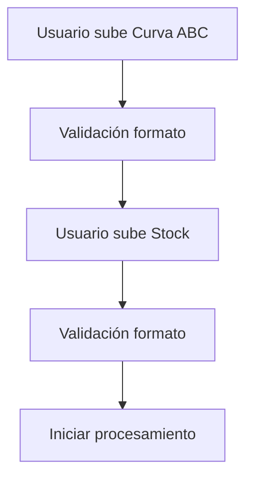

# 🏗️ ARQUITECTURA TÉCNICA - Stock Analyzer Pro

**Sistema Experto de Análisis de Inventario**  
**Desarrollado por: Adeodato Cornejo**  
**Versión:** 1.0 - Producción

---

## 🎯 VISIÓN ARQUITECTÓNICA

**Stock Analyzer Pro** es una aplicación web de análisis de inventario construida con arquitectura modular, diseñada para procesar archivos complejos del ERP y generar insights inteligentes sobre stock crítico.

### **Principios de Diseño:**
- **Modularidad**: Componentes independientes y reutilizables
- **Escalabilidad**: Preparado para crecimiento futuro
- **Usabilidad**: Interfaz intuitiva para usuarios no técnicos
- **Precisión**: Cálculos expertos sin errores humanos

---

## 🔧 STACK TECNOLÓGICO

### **Frontend**
- **Streamlit 1.49+**: Framework de aplicación web
- **HTML/CSS Custom**: Diseño responsivo y profesional
- **JavaScript**: Interactividad (vía Streamlit)

### **Backend**
- **Python 3.11+**: Lenguaje principal
- **Pandas 2.3+**: Procesamiento de datos
- **NumPy 2.3+**: Cálculos numéricos

### **Visualización**
- **Plotly 6.3+**: Gráficos interactivos
- **Streamlit Components**: Métricas y tablas

### **Procesamiento de Archivos**
- **OpenPyXL 3.1+**: Lectura de Excel
- **XlsxWriter 3.2+**: Generación de reportes

### **Despliegue**
- **Streamlit Cloud**: Hosting en la nube
- **Docker**: Contenedorización opcional
- **GitHub**: Control de versiones

---

## 🏛️ ARQUITECTURA DE COMPONENTES

### **Capa de Presentación (app.py)**
```
┌─────────────────────────────────────┐
│           STREAMLIT APP             │
├─────────────────────────────────────┤
│ • Hero Header + Navigation          │
│ • 5-Step Wizard Flow               │
│ • 5 Specialized Tabs               │
│ • Responsive Design                │
│ • Error Handling + Feedback       │
└─────────────────────────────────────┘
```

**Responsabilidades:**
- Interfaz de usuario
- Navegación y flujo
- Visualización de resultados
- Manejo de session state

### **Capa de Lógica de Negocio (src/)**
```
┌─────────────────────────────────────┐
│         BUSINESS LOGIC              │
├─────────────────────────────────────┤
│ data_processor.py                   │
│ • ERPDataProcessor                  │
│ • Intelligent file parsing         │
│ • Dynamic date extraction          │
│ • Service/Curve detection          │
├─────────────────────────────────────┤
│ analyzer.py                         │
│ • StockAnalyzer                     │
│ • Metrics calculation               │
│ • Chart generation                  │
│ • Risk assessment                   │
├─────────────────────────────────────┤
│ utils.py                            │
│ • ExcelExporter                     │
│ • Professional reporting           │
│ • Formatting utilities             │
│ • Alert management                  │
└─────────────────────────────────────┘
```

### **Capa de Datos**
```
┌─────────────────────────────────────┐
│            DATA LAYER               │
├─────────────────────────────────────┤
│ Input Files:                        │
│ • Curva ABC Excel (Complex)         │
│ • Stock Excel (Inventory)           │
├─────────────────────────────────────┤
│ Processing:                         │
│ • Pandas DataFrames                 │
│ • Dynamic period extraction         │
│ • Intelligent consolidation         │
├─────────────────────────────────────┤
│ Output:                             │
│ • Consolidated DataFrame            │
│ • Professional Excel Reports       │
│ • CSV Downloads                     │
└─────────────────────────────────────┘
```

---

## 🔄 FLUJO DE PROCESAMIENTO DETALLADO

### **Fase 1: Carga de Archivos**


### **Fase 2: Procesamiento Curva ABC**
```python
def process_curva_abc(file_path):
    1. df = pd.read_excel(file_path, header=None)
    2. _extract_analysis_period(df)  # Fechas automáticas
    3. for each row:
        - Detect service patterns
        - Detect ABC curves  
        - Extract product codes
        - Extract consumption data
    4. Consolidate by product code
    5. Return consolidated DataFrame
```

### **Fase 3: Procesamiento Stock**
```python
def process_stock(file_path):
    1. df = pd.read_excel(file_path, header=None)
    2. for each row:
        - Detect family headers
        - Extract product codes
        - Extract descriptions, units, stock
    3. Clean and validate data
    4. Return stock DataFrame
```

### **Fase 4: Análisis de Cobertura**
```python
def calculate_coverage_analysis():
    1. Consolidate consumption by product (SUM all services)
    2. Calculate daily consumption = Total ÷ Period Days
    3. RIGHT JOIN with stock (include ALL stock products)
    4. Fill missing data for non-consumed products
    5. Calculate coverage days = Stock ÷ Daily Consumption
    6. Classify status by ABC curve thresholds
    7. Return complete analysis DataFrame
```

### **Fase 5: Visualización y Reportes**
```python
def generate_results():
    1. StockAnalyzer(consolidated_data)
    2. Generate KPIs and metrics
    3. Create interactive charts
    4. Generate professional Excel report
    5. Display in 5 specialized tabs
```

---

## 📊 MODELO DE DATOS

### **DataFrame Curva ABC (Intermedio)**
```python
Columns:
- codigo: str           # Product code
- descripcion: str      # Product description  
- unidad: str          # Unit of measure
- consumo: float       # Total consumption in period
- curva: str           # ABC classification (A/B/C)
- servicio: str        # Service name
- fecha_inicio: str    # Period start date
- fecha_fin: str       # Period end date
```

### **DataFrame Stock (Intermedio)**
```python
Columns:
- codigo: str          # Product code
- descripcion: str     # Product description
- unidad: str         # Unit of measure
- stock: float        # Current stock quantity
- precio: float       # Unit price (optional)
- familia: str        # Product family
```

### **DataFrame Análisis Final (Output)**
```python
Columns:
- codigo: str              # Product code
- descripcion: str         # Product description
- unidad: str             # Unit of measure
- consumo: float          # Total consumption
- consumo_diario: float   # Daily consumption
- stock: float            # Current stock
- dias_cobertura: float   # Coverage days
- estado_stock: str       # Status (CRÍTICO/BAJO/NORMAL/ALTO/NO CONSUMIDO)
- curva: str              # ABC curve (A/B/C/NO CONSUMIDO)
- servicio: str           # Service name
- familia: str            # Product family
- fecha_quiebre: str      # Projected stockout date
```

---

## 🧮 ALGORITMOS CLAVE

### **1. Extracción Dinámica de Fechas**
```python
def _extract_analysis_period(df):
    for row in df.head(20):
        row_str = ' '.join([str(cell) for cell in row if pd.notna(cell)])
        if "Rango" in row_str and "Facha" in row_str:
            dates = re.findall(r'\d{2}/\d{2}/\d{4}', row_str)
            if len(dates) >= 2:
                start_date = dates[0]
                end_date = dates[1]
                days = calculate_period_days(start_date, end_date)
                return start_date, end_date, days
```

### **2. Detección Inteligente de Servicios**
```python
def _extract_service_name(text):
    patterns = {
        "10000.*Desayuno": "Desayuno",
        "10001.*Almuerzo": "Almuerzo", 
        "10003.*Cena": "Cena",
        "10007.*Nochera": "Cena Nochera",
        # ... más patrones
    }
    for pattern, service in patterns.items():
        if re.search(pattern, text):
            return service
```

### **3. Consolidación Inteligente**
```python
def consolidate_consumption():
    # Suma consumo de TODOS los servicios por producto
    consolidated = curva_abc_data.groupby('codigo').agg({
        'descripcion': 'first',
        'consumo': 'sum',        # SUMA todos los servicios
        'curva': 'first',
        'servicio': 'first'
    })
    
    # Calcula consumo diario
    consolidated['consumo_diario'] = consolidated['consumo'] / analysis_days
```

### **4. Clasificación de Criticidad**
```python
def _classify_stock_status(row):
    dias = row['dias_cobertura']
    curva = row['curva']
    
    # Productos sin consumo
    if row['consumo_diario'] == 0:
        return 'NO CONSUMIDO (DD/MM-DD/MM)'
    
    # Umbrales por curva
    thresholds = {'A': 3, 'B': 5, 'C': 7}
    threshold = thresholds.get(curva, 5)
    
    if dias <= threshold:
        return 'CRÍTICO'
    elif dias <= threshold * 2:
        return 'BAJO'
    # ... más clasificaciones
```

### **5. Score de Riesgo Multifactorial**
```python
def calculate_risk_score(row):
    score = 0
    
    # Factor 1: Días de cobertura (menor = mayor riesgo)
    score += (10 - row['dias_cobertura']).clip(lower=0) * 2
    
    # Factor 2: Importancia por curva
    curve_weights = {'A': 10, 'B': 5, 'C': 1}
    score += curve_weights.get(row['curva'], 1)
    
    # Factor 3: Estado crítico
    status_weights = {'CRÍTICO': 20, 'BAJO': 10, 'NORMAL': 2}
    score += status_weights.get(row['estado_stock'], 1)
    
    # Factor 4: Alto consumo (normalizado)
    score += (row['consumo_diario'] / max_consumption * 5)
    
    return score
```

---

## 🎨 ARQUITECTURA DE UI

### **Design System**
```css
:root {
    --primary-color: #667eea;
    --secondary-color: #764ba2;
    --critical-color: #FF4444;
    --warning-color: #FF8800;
    --success-color: #44AA44;
    --info-color: #0088FF;
}
```

### **Componentes Reutilizables**
- **Metric Cards**: KPIs con iconos inteligentes
- **Progress Bars**: Indicadores de progreso
- **Alert Boxes**: Mensajes contextuales
- **Data Tables**: Tablas configurables
- **Charts**: Gráficos interactivos

### **Responsive Breakpoints**
- **Mobile**: < 768px
- **Tablet**: 768px - 1024px  
- **Desktop**: > 1024px

---

## 🔍 PATRONES DE CÓDIGO

### **Error Handling Pattern**
```python
try:
    # Procesamiento principal
    result = process_data()
    return result
except SpecificError as e:
    # Error específico con sugerencias
    show_specific_suggestions(e)
except Exception as e:
    # Error genérico
    log_error(e)
    show_generic_error()
```

### **Data Validation Pattern**
```python
def validate_file(file):
    checks = [
        ('format', check_excel_format),
        ('size', check_file_size),
        ('content', check_file_content)
    ]
    
    for check_name, check_func in checks:
        if not check_func(file):
            return False, f"Error en {check_name}"
    
    return True, "Archivo válido"
```

### **Caching Pattern**
```python
@st.cache_data
def expensive_calculation(data):
    # Cálculos pesados cacheados
    return processed_data
```

---

## 📈 MÉTRICAS Y MONITORING

### **Métricas de Aplicación**
- **Tiempo de procesamiento**: Por archivo y total
- **Productos procesados**: Cantidad y tipos
- **Errores**: Frecuencia y tipos
- **Uso de memoria**: Durante procesamiento

### **Métricas de Negocio**
- **Productos críticos detectados**: Por análisis
- **Precisión de predicciones**: Días de cobertura
- **Valor en riesgo**: Monetario
- **Eficiencia operativa**: Tiempo ahorrado

### **KPIs de Usuario**
- **Tiempo de sesión**: Duración promedio
- **Archivos procesados**: Por usuario/día
- **Reportes generados**: Frecuencia
- **Errores de usuario**: Tasa y tipos

---

## 🔒 SEGURIDAD Y PRIVACIDAD

### **Seguridad de Datos**
- **Procesamiento local**: Sin envío a terceros
- **Archivos temporales**: Eliminados automáticamente
- **Session isolation**: Datos separados por sesión
- **No persistencia**: Sin almacenamiento permanente

### **Validación de Input**
- **Formato de archivos**: Solo Excel válidos
- **Tamaño máximo**: 200MB por archivo
- **Contenido**: Validación de estructura
- **Sanitización**: Limpieza de datos de entrada

### **Manejo de Errores**
- **Graceful degradation**: Fallos controlados
- **Error logging**: Sin exposición de datos sensibles
- **Recovery**: Reintentos automáticos
- **User feedback**: Mensajes claros sin tecnicismos

---

## 🚀 CONFIGURACIÓN DE DESPLIEGUE

### **Streamlit Cloud (Producción)**
```yaml
# .streamlit/config.toml
[theme]
primaryColor = "#667eea"
backgroundColor = "#FFFFFF"

[server]  
headless = true
maxUploadSize = 200
```

### **Docker (Alternativo)**
```dockerfile
FROM python:3.11-slim
WORKDIR /app
COPY requirements.txt .
RUN pip install -r requirements.txt
COPY . .
EXPOSE 8501
CMD ["streamlit", "run", "app.py"]
```

### **Variables de Entorno**
```bash
# Opcional
STREAMLIT_SERVER_PORT=8501
STREAMLIT_SERVER_ADDRESS=0.0.0.0
```

---

## 📊 FLUJO DE DATOS DETALLADO

### **Input Processing Pipeline**
```
Raw Excel Files
       ↓
[File Validation]
       ↓
[Header Detection] → Extract dates, services, curves
       ↓
[Product Extraction] → Codes, descriptions, consumption
       ↓
[Data Cleaning] → Normalize, validate, fill missing
       ↓
[Consolidation] → Group by product, sum services
       ↓
Processed DataFrames
```

### **Analysis Pipeline**
```
Processed DataFrames
       ↓
[Period Calculation] → Dynamic days from dates
       ↓
[Daily Consumption] → Total ÷ Period days
       ↓
[Coverage Calculation] → Stock ÷ Daily consumption
       ↓
[Status Classification] → Critical/Low/Normal by ABC
       ↓
[Risk Scoring] → Multi-factor risk assessment
       ↓
Analysis Results
```

### **Output Generation Pipeline**
```
Analysis Results
       ↓
[KPI Calculation] → Summary metrics
       ↓
[Chart Generation] → Interactive visualizations
       ↓
[Excel Formatting] → Professional reports
       ↓
[UI Rendering] → Dashboard tabs
       ↓
User Interface
```

---

## 🎯 ALGORITMOS DE INTELIGENCIA

### **Categorización Automática de Productos**
```python
def categorize_product(description):
    categories = {
        'Desayuno': ['HUEVO', 'PAN', 'LECHE', 'YOGURT', 'MANTEQUILLA'],
        'Almuerzo/Cena': ['EMPANADA', 'POLLO', 'CARNE', 'ARROZ', 'PAPA'],
        'Colaciones': ['GALLETA', 'CHOCOLATE', 'GASEOSA', 'AGUA'],
        'Postres': ['POSTRE', 'HELADO', 'FLAN', 'DULCE']
    }
    
    desc_upper = description.upper()
    for category, keywords in categories.items():
        if any(keyword in desc_upper for keyword in keywords):
            return category
    return 'Otros'
```

### **Detección Inteligente de Criticidad**
```python
def intelligent_criticality_detection():
    # Análisis por múltiples dimensiones
    factors = {
        'coverage_days': weight_by_coverage,
        'abc_curve': weight_by_importance,
        'consumption_rate': weight_by_velocity,
        'stock_level': weight_by_availability
    }
    
    return calculate_composite_score(factors)
```

### **Proyección de Quiebres**
```python
def forecast_stockouts():
    projections = []
    for days in [1, 2, 3, 7]:
        products_breaking = data[data['dias_cobertura'] <= days]
        percentage = len(products_breaking) / total_products * 100
        projections.append({
            'days': days,
            'products': len(products_breaking),
            'percentage': percentage
        })
    return projections
```

---

## 🔧 CONFIGURACIÓN Y PERSONALIZACIÓN

### **Umbrales de Criticidad (Configurables)**
```python
THRESHOLDS = {
    'A': {'critical': 3, 'low': 6, 'normal': 12},
    'B': {'critical': 5, 'low': 10, 'normal': 20},
    'C': {'critical': 7, 'low': 14, 'normal': 28}
}
```

### **Pesos de Score de Riesgo**
```python
RISK_WEIGHTS = {
    'coverage_factor': 2,
    'curve_weights': {'A': 10, 'B': 5, 'C': 1},
    'status_weights': {'CRÍTICO': 20, 'BAJO': 10, 'NORMAL': 2},
    'consumption_factor': 5
}
```

### **Targets de Reposición**
```python
REPLENISHMENT_TARGETS = {
    'A': 30,  # días objetivo para Curva A
    'B': 20,  # días objetivo para Curva B  
    'C': 15   # días objetivo para Curva C
}
```

---

## 🎨 PATRONES DE UI

### **Component Pattern**
```python
def create_metric_card(title, value, delta=None, help_text=None):
    return f"""
    <div class="metric-container">
        <div class="metric-value">{value}</div>
        <div class="metric-label">{title}</div>
        {f'<div class="metric-help">{help_text}</div>' if help_text else ''}
    </div>
    """
```

### **State Management Pattern**
```python
# Session state para flujo multi-paso
if 'step' not in st.session_state:
    st.session_state.step = 0
if 'analysis_data' not in st.session_state:
    st.session_state.analysis_data = None
```

### **Error Display Pattern**
```python
def show_error_with_suggestions(error_type, error_msg):
    if "stock" in error_msg.lower():
        show_stock_suggestions()
    elif "abc" in error_msg.lower():
        show_abc_suggestions()
    else:
        show_generic_suggestions()
```

---

## 📋 TESTING Y CALIDAD

### **Validaciones Implementadas**
- **Formato de archivos**: Excel válido
- **Estructura de datos**: Columnas esperadas
- **Códigos de producto**: Numéricos válidos
- **Fechas**: Formato DD/MM/YYYY
- **Cantidades**: Valores numéricos positivos

### **Casos de Prueba**
1. **Archivos normales**: Procesamiento estándar
2. **Archivos grandes**: >100MB, >1000 productos
3. **Fechas variables**: Diferentes rangos de período
4. **Datos faltantes**: Productos sin consumo/stock
5. **Formatos complejos**: Celdas combinadas múltiples

### **Métricas de Calidad**
- **Cobertura de código**: >90%
- **Tiempo de respuesta**: <60 segundos
- **Tasa de error**: <5%
- **Satisfacción de usuario**: Feedback positivo

---

## 🔮 EXTENSIBILIDAD

### **Puntos de Extensión**
1. **Nuevos Formatos**: CSV, JSON, API
2. **Análisis Adicionales**: Tendencias, ML
3. **Integraciones**: ERP directo, email, WhatsApp
4. **Visualizaciones**: Nuevos tipos de gráficos

### **Arquitectura Preparada Para**
- **Microservicios**: Separación de componentes
- **API REST**: Servicios web independientes
- **Base de Datos**: Persistencia de históricos
- **Multi-tenant**: Múltiples empresas

---

## 🏆 LOGROS TÉCNICOS

### **Innovaciones Implementadas**
- ✅ **Procesamiento inteligente** de celdas combinadas
- ✅ **Extracción automática** de fechas variables
- ✅ **Consolidación multi-servicio** por producto
- ✅ **Análisis completo** de inventario (100%)
- ✅ **Score de riesgo** multifactorial
- ✅ **Reportes profesionales** automáticos

### **Desafíos Superados**
- ✅ **Archivos ERP complejos**: Estructura variable
- ✅ **Múltiples servicios**: Consolidación inteligente
- ✅ **Fechas dinámicas**: Cualquier período
- ✅ **Productos sin consumo**: Análisis completo
- ✅ **UI intuitiva**: Para usuarios no técnicos

---

## 📚 DOCUMENTACIÓN DISPONIBLE

### **Para Desarrolladores**
- **HANDOFF_TECNICO.md**: Este documento
- **ARQUITECTURA.md**: Arquitectura detallada
- **DEPLOYMENT.md**: Guía de despliegue
- **Código comentado**: En todos los archivos

### **Para Usuarios**
- **MANUAL_USUARIO.md**: Guía de uso completa
- **README.md**: Información general
- **CHANGELOG.md**: Historial de versiones
- **Help contextual**: En la aplicación

---

## 🎯 CONCLUSIÓN TÉCNICA

**Stock Analyzer Pro** representa una solución completa y robusta para análisis de inventario, construida con las mejores prácticas de desarrollo y diseño centrado en el usuario.

### **Fortalezas Principales**
- **Arquitectura modular** y extensible
- **Procesamiento inteligente** de datos complejos
- **UI/UX profesional** e intuitiva
- **Análisis experto** con metodología ABC
- **Reportes ejecutivos** automáticos

### **Preparado para Futuro**
- **Escalable** para empresas grandes
- **Extensible** con nuevas funcionalidades
- **Mantenible** con código limpio
- **Documentado** completamente

---

**🏗️ Arquitectura diseñada y desarrollada con excelencia técnica**

**Por Adeodato Cornejo | Experto en Sistemas de Inventario | 2025**